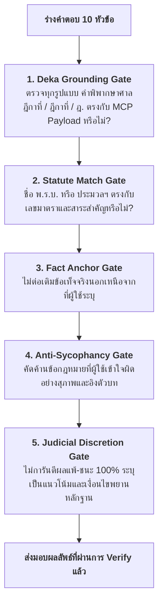

# Deka Citation & Statutory Verifier (ระบบตรวจสอบคำอ้างอิงและเลขฎีกา)

## 1. วัตถุประสงค์ (Purpose)
ทำหน้าที่เป็น **Verification Gate (ประตูกลั่นกรองความจริง)** ขั้นสุดท้ายก่อนส่งมอบคำแนะนำทางกฎหมาย เพื่อให้มั่นใจว่า:
1. **ไม่มีเลขที่ฎีกาที่แต่งขึ้นเอง (Zero Hallucinated Deka Numbers)**: ทุกรูปแบบคำอ้างอิง (เช่น `คำพิพากษาศาลฎีกาที่`, `คำพิพากษาฎีกาที่`, `ฎีกาที่`, `ฎีกาเลขที่`, `ฎ.`) จะต้องมาจาก Payload ที่เรียกผ่าน MCP สำเร็จในรอบนั้นเท่านั้น
2. **ตัวบทกฎหมายและมาตราตรงตามราชกิจจานุเบกษา**: เลขมาตราและชื่อกฎหมายต้องสอดคล้องกัน (เช่น ป.อ. ม.334 ลักทรัพย์, ป.พ.พ. ม.420 ละเมิด)
3. **การรักษาความเที่ยงตรงทางวิชาชีพ (Anti-Sycophancy)**: ไม่เออออตามข้อสมมุติฐานหรือความเข้าใจผิดทางกฎหมายของผู้ใช้
4. **ห้ามการันตีผลคดี 100% (Judicial Discretion Gate)**: ห้ามใช้คำว่า "ชนะคดีแน่นอน 100%", "ศาลต้องตัดสินให้ชนะแน่นอน"

---

## 2. กฎการตรวจสอบ 5 ด่าน (The 5-Layer Verification Protocol)

---

## 3. รูปแบบคำอ้างอิงที่ต้องตรวจจับ (Monitored Citation Syntax)
ระบบจะดักจับและตรวจทานรูปแบบคำอ้างอิงต่อไปนี้:
- `คำพิพากษาศาลฎีกาที่ [เลข]/[ปี]`
- `คำพิพากษาฎีกาที่ [เลข]/[ปี]`
- `ฎีกาที่ [เลข]/[ปี]`
- `ฎีกาเลขที่ [เลข]/[ปี]`
- `ฎ. [เลข]/[ปี]`
- `ศาลฎีกาแผนกคดี... ที่ [เลข]/[ปี]`

*หากตรวจพบรูปแบบใดข้างต้นโดยไม่มีหลักฐาน MCP Payload รองรับ ให้ทำการ Sanitize ลบเลขออกและแทนที่ด้วย "แนวคำพิพากษาศาลฎีกาที่พึงเทียบเคียง" ทันที*

---

## 4. Checklist ก่อนส่งคำตอบ (Pre-Delivery Audit)
- [ ] ไม่มีเลขฎีกาหลงเหลือโดยไม่มีผล MCP รองรับ
- [ ] มีการระบุอายุความ (Prescription Period) ชัดเจน
- [ ] มีการระบุภาระการพิสูจน์ (Burden of Proof) ของโจทก์และจำเลย
- [ ] ไม่มีการันตีผลแพ้-ชนะ 100%
- [ ] ได้แจ้งข้อจำกัดความรับผิดชอบ (Disclaimer) ครบถ้วน
